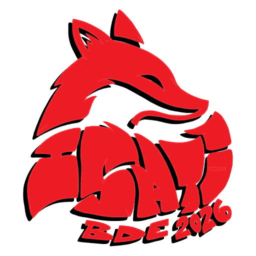

<a id="readme-top"></a>

[![Contributors][contributors-shield]][contributors-url]
[![Forks][forks-shield]][forks-url]
[![Stargazers][stars-shield]][stars-url]
[![Issues][issues-shield]][issues-url]
[![AGPL-3.0 License][license-shield]][license-url]
[![LinkedIn][linkedin-shield]][linkedin-url]


<br />
<div align="center">
  <a href="https://github.com/BDE-ISATI/isati-website">
    
  </a>

  <h3 align="center">ISATI Website</h3>

  <p align="center">
    The website of ISATI, the student association of ESIR (University of Rennes).
    <br />
    <br />
    <a href="https://isati.org">View Website</a>
    &middot;
    <a href="https://github.com/BDE-ISATI/isati-website/issues/new?labels=bug&template=bug-report---.md">Report Bug</a>
    &middot;
    <a href="https://github.com/BDE-ISATI/isati-website/issues/new?labels=enhancement&template=feature-request---.md">Request Feature</a>
  </p>
</div>


<details>
  <summary>Table of Contents</summary>
  <ol>
    <li>
      <a href="#about-the-project">About the Project</a>
      <ul>
        <li><a href="#built-with">Built With</a></li>
      </ul>
    </li>
    <li>
      <a href="#getting-started">Getting Started</a>
      <ul>
        <li><a href="#prerequisites">Prerequisites</a></li>
        <li><a href="#installation">Installation</a></li>
        <li><a href="#environment-variables">Environment Variables</a></li>
      </ul>
    </li>
    <li><a href="#available-scripts">Available Scripts</a></li>
    <li><a href="#project-structure">Project Structure</a></li>
    <li><a href="#conventions">Conventions</a></li>
    <li><a href="#roadmap">Roadmap</a></li>
    <li><a href="#contributing">Contributing</a></li>
    <li><a href="#license">License</a></li>
    <li><a href="#contact">Contact</a></li>
    <li><a href="#acknowledgments">Acknowledgments</a></li>
  </ol>
</details>


## About the Project

[![Website screenshot][product-screenshot]](https://isati.org)

Website of ISATI, the student association of ESIR (University of Rennes).

It covers association life: news, clubs, committee and the WEI.

This repository holds the **frontend only**. The backend lives in
[BDE-ISATI/isati-backend](https://github.com/BDE-ISATI/isati-backend).

<p align="right">(<a href="#readme-top">back to top</a>)</p>


### Built With

* [![React][React.js]][React-url]
* [![TypeScript][TypeScript]][TypeScript-url]
* [![Vite][Vite]][Vite-url]
* [![TailwindCSS][Tailwind]][Tailwind-url]
* [![TanStack Query][TanStack]][TanStack-url]
* [![PocketBase][PocketBase]][PocketBase-url]

<p align="right">(<a href="#readme-top">back to top</a>)</p>


## Getting Started

### Prerequisites

* [Node.js](https://nodejs.org/) 24 or later, with npm
* A running instance of the [isati-backend](https://github.com/BDE-ISATI/isati-backend) (PocketBase)

### Installation

1. Clone the repo
   ```sh
   git clone https://github.com/BDE-ISATI/isati-website.git
   cd isati-website
   ```
2. Install NPM packages
   ```sh
   npm install
   ```
3. Create a `.env` file (see [Environment Variables](#environment-variables))
4. Start the development server
   ```sh
   npm run dev
   ```

### Environment Variables

Create a `.env` file at the root of the project:

```env
VITE_PB_URL=http://127.0.0.1:8090
VITE_ALLOW_TEST_EMAILS=false
```

| Variable                 | Description                                   |
| ------------------------ | --------------------------------------------- |
| `VITE_PB_URL`            | URL of the PocketBase backend                 |
| `VITE_ALLOW_TEST_EMAILS` | Set to `true` to accept test email addresses  |

<p align="right">(<a href="#readme-top">back to top</a>)</p>


## Available Scripts

| Command           | Description                                                                                       |
| ----------------- | ------------------------------------------------------------------------------------------------- |
| `npm run dev`     | Starts the Vite development server                                                                |
| `npm run build`   | Type-checks and builds the app for production into `dist/`                                        |
| `npm run lint`    | Lints the code with oxlint                                                                        |
| `npm run preview` | Serves the production build locally                                                               |
| `npm run types`   | Generates `src/shared/types/pocketbase-types.ts` from `../isati-backend/pb_data/data.db`          |

<p align="right">(<a href="#readme-top">back to top</a>)</p>


## Project Structure

```
src/
├── components/
│   └── layout/        # App layout
├── features/          # Feature modules
│   ├── auth/
│   ├── navLinks/
│   ├── profile/
│   ├── roles/
│   └── wei/
├── pages/             # Route pages (Auth, Home, Legal, Profile, Wei, NotFound)
└── shared/            # Code shared across features
    ├── components/
    ├── constants/
    ├── hooks/
    ├── lib/
    ├── types/
    └── utils/
```

<p align="right">(<a href="#readme-top">back to top</a>)</p>


## Conventions

* Code is organised by feature in `src/features/`; anything reused across features goes in `src/shared/`.
* Run `npm run lint` before opening a pull request.
* PocketBase types are generated with `npm run types`, never edited by hand.

<p align="right">(<a href="#readme-top">back to top</a>)</p>


## Roadmap

- [ ] Clubs
- [ ] BDE membership
- [ ] Collaborative space for past exams
- [ ] Home page (in progress)
- [ ] Rooms (in progress)
- [ ] Ongoing events
- [ ] WEI feature code cleanup

See the [open issues](https://github.com/BDE-ISATI/isati-website/issues) for a full list of proposed features (and known issues).

<p align="right">(<a href="#readme-top">back to top</a>)</p>


## Contributing

1. Fork the Project
2. Create your Feature Branch (`git checkout -b feature/AmazingFeature`)
3. Commit your Changes (`git commit -m 'Add some AmazingFeature'`)
4. Push to the Branch (`git push origin feature/AmazingFeature`)
5. Open a Pull Request against `main`

### Top contributors:

<a href="https://github.com/BDE-ISATI/isati-website/graphs/contributors">
  
</a>

<p align="right">(<a href="#readme-top">back to top</a>)</p>


## License

Distributed under the GNU Affero General Public License v3. See `LICENSE` for more information.

<p align="right">(<a href="#readme-top">back to top</a>)</p>


## Contact

All contacts are listed on the home page of [isati.org](https://isati.org).

Project Link: [https://github.com/BDE-ISATI/isati-website](https://github.com/BDE-ISATI/isati-website)

<p align="right">(<a href="#readme-top">back to top</a>)</p>


## Acknowledgments

* [Best-README-Template](https://github.com/othneildrew/Best-README-Template)
* [Shields.io](https://shields.io)
* [contrib.rocks](https://contrib.rocks)

<p align="right">(<a href="#readme-top">back to top</a>)</p>


[contributors-shield]: https://img.shields.io/github/contributors/BDE-ISATI/isati-website.svg?style=for-the-badge
[contributors-url]: https://github.com/BDE-ISATI/isati-website/graphs/contributors
[forks-shield]: https://img.shields.io/github/forks/BDE-ISATI/isati-website.svg?style=for-the-badge
[forks-url]: https://github.com/BDE-ISATI/isati-website/network/members
[stars-shield]: https://img.shields.io/github/stars/BDE-ISATI/isati-website.svg?style=for-the-badge
[stars-url]: https://github.com/BDE-ISATI/isati-website/stargazers
[issues-shield]: https://img.shields.io/github/issues/BDE-ISATI/isati-website.svg?style=for-the-badge
[issues-url]: https://github.com/BDE-ISATI/isati-website/issues
[license-shield]: https://img.shields.io/github/license/BDE-ISATI/isati-website.svg?style=for-the-badge
[license-url]: https://github.com/BDE-ISATI/isati-website/blob/main/LICENSE
[linkedin-shield]: https://img.shields.io/badge/-LinkedIn-black.svg?style=for-the-badge&logo=linkedin&colorB=555
[linkedin-url]: https://fr.linkedin.com/company/bde-isati
[product-screenshot]: images/screenshot.jpg
[React.js]: https://img.shields.io/badge/React-20232A?style=for-the-badge&logo=react&logoColor=61DAFB
[React-url]: https://react.dev/
[TypeScript]: https://img.shields.io/badge/TypeScript-3178C6?style=for-the-badge&logo=typescript&logoColor=white
[TypeScript-url]: https://www.typescriptlang.org/
[Vite]: https://img.shields.io/badge/Vite-646CFF?style=for-the-badge&logo=vite&logoColor=white
[Vite-url]: https://vite.dev/
[Tailwind]: https://img.shields.io/badge/Tailwind_CSS-38B2AC?style=for-the-badge&logo=tailwind-css&logoColor=white
[Tailwind-url]: https://tailwindcss.com/
[TanStack]: https://img.shields.io/badge/TanStack_Query-FF4154?style=for-the-badge&logo=reactquery&logoColor=white
[TanStack-url]: https://tanstack.com/query/latest
[PocketBase]: https://img.shields.io/badge/PocketBase-B8DBE4?style=for-the-badge&logo=pocketbase&logoColor=black
[PocketBase-url]: https://pocketbase.io/
